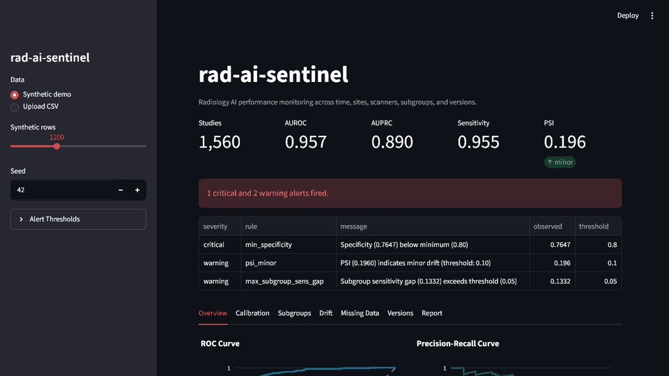
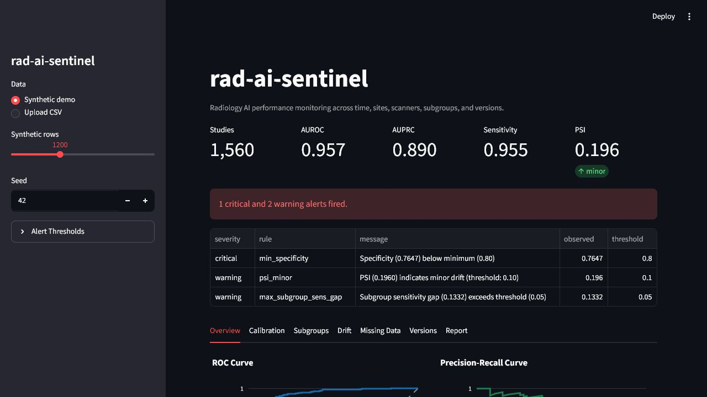
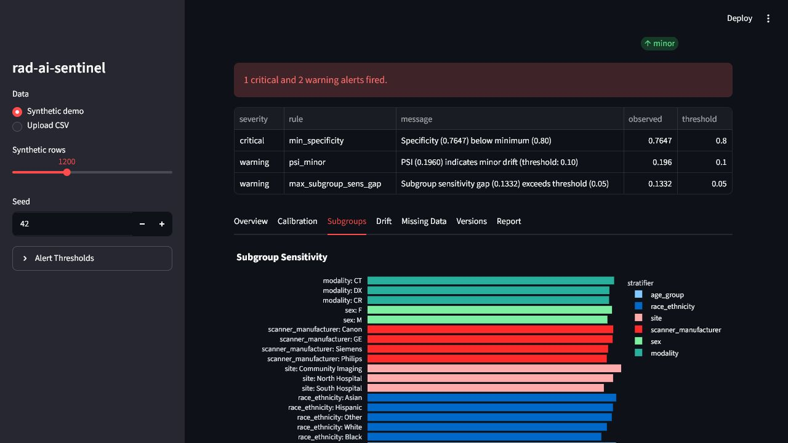
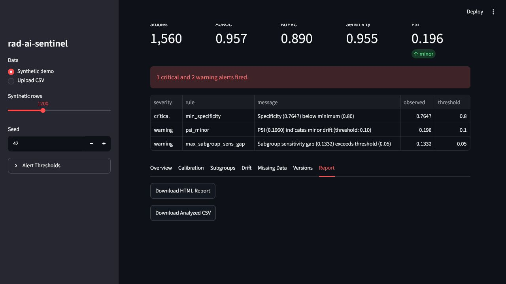
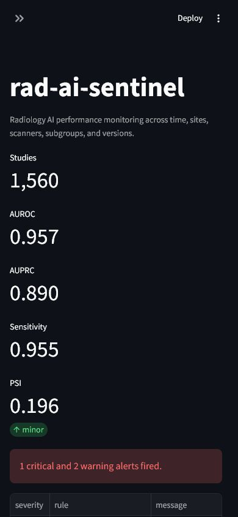

# rad-ai-sentinel

[](https://github.com/AKaturu/rad-ai-sentinel/actions/workflows/ci.yml)
[](https://www.python.org/)
[](LICENSE)

**An open-source framework for site-, scanner-, subgroup-, version-, and time-stratified surveillance of radiology AI performance.**

`rad-ai-sentinel` operationalizes post-deployment monitoring for existing imaging AI model outputs. It does **not** train an imaging model. Bring a CSV of predictions, ground truth, and study metadata; the tool validates the file, computes performance and drift metrics, surfaces stop-rule alerts, and generates a downloadable monitoring report.

The project is motivated by the ACR-SIIM Practice Parameter for Imaging AI, approved by the ACR Council on May 5, 2026, which emphasizes AI inventory/version tracking, local acceptance testing, ongoing performance monitoring, drift/safety evaluation, stop rules, and privacy controls.

## Repository Guide

| Path | Purpose |
|---|---|
| `src/rad_ai_sentinel/cli.py` | CLI commands for demo generation, analysis, reports, and adapters |
| `src/rad_ai_sentinel/analysis.py` | Shared analysis pipeline |
| `src/rad_ai_sentinel/metrics/` | Binary, curve, calibration, confidence interval, and subgroup metrics |
| `src/rad_ai_sentinel/drift/` | Missingness, drift, alert, and model-version checks |
| `src/rad_ai_sentinel/app/main.py` | Streamlit dashboard |
| `src/rad_ai_sentinel/report/` | HTML/PDF report generation |
| `docs/` | Requirements, architecture, data-source notes, and research context |
| `tests/` | Schema, metrics, drift, and product-surface tests |

## Demo



PDF export walkthrough:

<video src="screenshots/demo-pdf-export.webm" controls width="100%"></video>

Direct video link: [screenshots/demo-pdf-export.webm](screenshots/demo-pdf-export.webm)

## Screenshots









## What It Produces

- Sensitivity, specificity, PPV, NPV, accuracy, F1, prevalence, AUROC, and AUPRC.
- Wilson confidence intervals for 2x2 metrics and bootstrap CIs for curve/calibration metrics.
- Calibration analysis with Brier score, expected calibration error, and reliability curves.
- Subgroup performance by age group, sex, race/ethnicity, site, scanner manufacturer, and modality.
- Scanner- and site-specific performance tables.
- Missing-data analysis, including subgroup availability and outcome-associated missingness flags.
- Temporal drift detection with PSI, KL divergence, rolling AUROC, and CUSUM.
- Configurable stop-rule alerts.
- Model-version comparisons, including DeLong AUROC comparison when versions share a common case set.
- Machine-readable CSV/JSON outputs.
- Downloadable HTML report, with optional PDF export when WeasyPrint system libraries are installed.

## Quick Start

```bash
pip install -e ".[dev]"

# Generate synthetic monitoring data, metrics, and an HTML report.
rad-ai-sentinel demo

# Analyze your own monitoring CSV.
rad-ai-sentinel compute --csv path/to/predictions.csv --output outputs/analysis

# Generate a report.
rad-ai-sentinel report --csv path/to/predictions.csv --output outputs/report

# Launch the dashboard.
rad-ai-sentinel serve
```

Then open [http://localhost:8501](http://localhost:8501).

## Docker

```bash
docker build -t rad-ai-sentinel .
docker run --rm -p 8501:8501 rad-ai-sentinel
```

## Desktop Downloads

Tagged releases can provide native desktop artifacts for Windows, macOS, and Linux. These launch the dashboard locally in your browser and do not require API keys.

See [docs/DESKTOP_RELEASES.md](docs/DESKTOP_RELEASES.md) for build and release details.

## CSV Format

| column | type | required | description |
|---|---:|:---:|---|
| `patient_id` | string | yes | de-identified patient identifier |
| `study_date` | date | yes | examination date, `YYYY-MM-DD` |
| `site` | string | no | site, facility, or reader group |
| `scanner_manufacturer` | string | no | scanner manufacturer |
| `modality` | string | no | modality such as `DX`, `CR`, `CT`, `MR` |
| `age_group` | string | no | age band such as `18-39`, `40-64`, `65+` |
| `sex` | string | no | sex where available and appropriate |
| `race_ethnicity` | string | no | race/ethnicity where available and appropriate |
| `model_version` | string | yes | model version label |
| `y_true` | int | yes | ground-truth label, 0 or 1 |
| `y_pred_proba` | float | yes | model probability for class 1, from 0 to 1 |
| `y_pred_binary` | int | yes | thresholded prediction, 0 or 1 |

Optional metadata columns may be absent or partially missing. Missingness is reported rather than silently ignored.

## Public Data Smoke Test

Public radiology datasets usually include images, labels, and metadata, but not deployed AI outputs. For a public smoke test, use the RSNA Pneumonia Detection Challenge labels and add either your own model predictions or deterministic synthetic scores for pipeline validation:

```bash
rad-ai-sentinel adapt-rsna stage_2_train_labels.csv outputs/rsna_monitoring.csv
rad-ai-sentinel report --csv outputs/rsna_monitoring.csv --output outputs/rsna_report
```

With model predictions:

```bash
rad-ai-sentinel adapt-rsna stage_2_train_labels.csv outputs/rsna_monitoring.csv \
  --predictions-csv my_model_predictions.csv \
  --metadata-csv dicom_metadata_extract.csv \
  --model-version pneumonia-model-v1
```

See [docs/DATA_SOURCES.md](docs/DATA_SOURCES.md) for RSNA/NIH, MIMIC-CXR, NIH ChestX-ray, and CheXpert notes.
For a reusable RSNA external-prediction case-study scaffold:

```bash
rad-ai-sentinel rsna-case-study-template docs/case_studies/rsna_external_predictions
```

The scaffold includes prediction and metadata CSV templates, a short analysis
plan, and language that keeps software demonstration separate from clinical
validation claims.

## Development

```bash
python -m pip install --upgrade pip
python -m pip install -e ".[dev]"
python -m ruff check .
python -m pytest
```

Quality gates:

| Check | Command |
|---|---|
| Lint | `python -m ruff check .` |
| Tests | `python -m pytest` |
| Demo smoke test | `rad-ai-sentinel demo --output outputs/demo --n 1200 --seed 42` |
| Dashboard | `rad-ai-sentinel serve` |

GitHub Actions runs linting and tests on Python 3.12.

## Documentation

- [Requirements](docs/REQUIREMENTS.md)
- [Architecture](docs/ARCHITECTURE.md)
- [Data Sources](docs/DATA_SOURCES.md)
- [Desktop Releases](docs/DESKTOP_RELEASES.md)
- [Roadmap](docs/ROADMAP.md)
- [Research Notes](docs/RESEARCH.md)

## Contributing

Issues and pull requests are welcome. See [CONTRIBUTING.md](CONTRIBUTING.md). Do not include patient data, credentials, or private institutional outputs in issues, tests, screenshots, or examples.

## Security

For vulnerability reporting and data-handling expectations, see [SECURITY.md](SECURITY.md).

## Safety Note

This project is for monitoring and research workflows. It is not a medical device, does not certify clinical performance, and should not be used to make patient-care decisions without appropriate institutional review, validation, governance, privacy controls, and clinical oversight.

## License

MIT. See [LICENSE](LICENSE).
