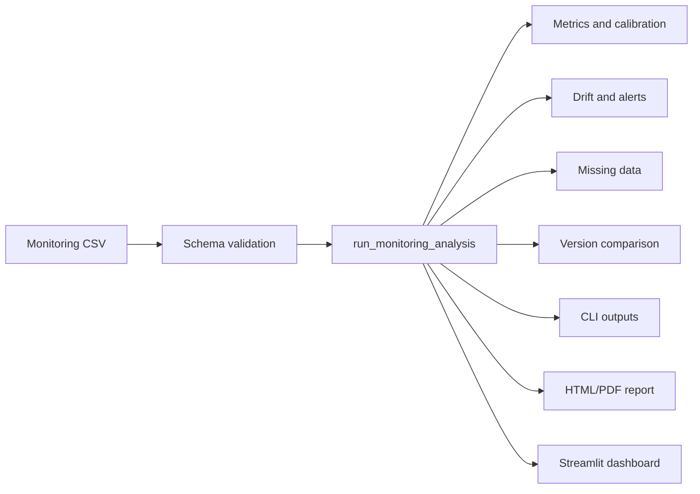

# Architecture

## Components

- `schemas`: validates the public CSV contract with `pandera`.
- `metrics`: computes binary metrics, curves, calibration, confidence intervals, stratification, and DeLong comparisons.
- `drift`: computes PSI, KL divergence, rolling AUROC, CUSUM, missing-data analysis, alerts, and version comparisons.
- `data`: generates synthetic monitoring data and adapts RSNA Pneumonia labels into the monitoring schema.
- `analysis`: orchestrates validation, metrics, drift, missingness, alerts, version comparisons, and output tables.
- `plots`: creates interactive Plotly figures for the dashboard.
- `report`: renders HTML and optional PDF reports from the shared analysis object.
- `cli`: exposes `demo`, `compute`, `report`, `serve`, and `adapt-rsna`.
- `app`: Streamlit dashboard.

## Data Flow

## Interfaces

- `run_monitoring_analysis(df) -> MonitoringAnalysis`
- `write_analysis_outputs(analysis, output_dir) -> dict[str, Path]`
- `generate_monitoring_report(data, output_dir) -> ReportArtifacts`
- `generate_synthetic_monitoring_data(n, seed) -> pd.DataFrame`
- `adapt_rsna_pneumonia_labels(labels_csv, output_csv, ...) -> pd.DataFrame`

## Failure Modes

- Missing required columns: schema validation fails before analysis.
- Optional metadata missing: analysis continues and reports missingness.
- Single-class windows: AUROC is omitted for that window rather than crashing.
- PDF system dependency missing: HTML report is still produced and a PDF error file is written.
- Public data without predictions: RSNA adapter marks generated scores as synthetic pipeline-test predictions by requiring an explicit command path rather than silently treating them as real deployment data.
